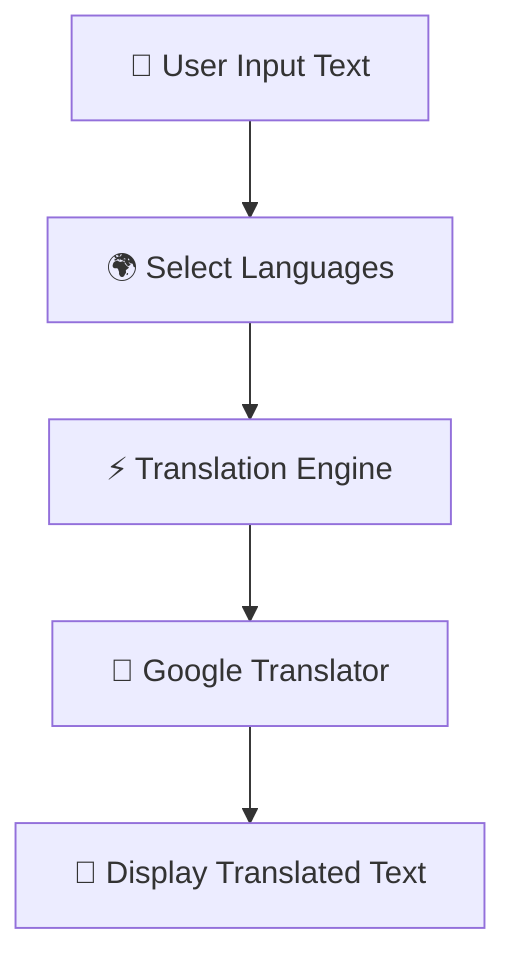

# 📝 Translingo Sense

<p align="center">
Free & Unlimited AI Translation using Python & Streamlit
</p>

<p align="center">


</p>

---

## 🌍 Overview

**Translingo Sense** is a modern AI-powered language translation web application built using **Streamlit** and **Deep Translator**.

The application allows users to translate text between **100+ languages** instantly with automatic language detection and a clean interactive UI.

This project demonstrates:

✔ Real-Time Translation
✔ Streamlit Web App Development
✔ API-Free Translation Engine
✔ User-Friendly Interface
✔ Multi-Language Support
✔ AI-Powered Text Processing

---

## 🚀 Features

* 🌐 Translate text into 100+ languages
* ⚡ Fast and accurate translation
* 🔍 Automatic language detection
* 🎨 Clean & responsive UI
* 🔐 No API key required
* 📱 Streamlit-powered interactive app
* 💬 Unlimited translations

---

## 🛠️ Tech Stack

* Python
* Streamlit
* Deep Translator
* GoogleTranslator API Wrapper

---

## 📂 Project Structure

```bash
Translingo-Sense/
│── app.py
│── requirements.txt
│── README.md
```

---

## ⚙️ How It Works



---

## 📊 Core Functionalities

### 🔹 Language Selection

Users can select source and target languages dynamically.

```python
source_lang = st.selectbox("From (Source Language)", ["auto"] + languages)
target_lang = st.selectbox("To (Target Language)", languages)
```

---

### 🔹 Automatic Language Detection

The app supports automatic language detection using:

```python
source='auto'
```

---

### 🔹 AI Translation Engine

Translation is performed using `GoogleTranslator`.

```python
translated_text = GoogleTranslator(
    source=source_lang,
    target=langs_dict[target_lang]
).translate(text_to_translate)
```

---

## 📈 Features Included

* Text Translation
* Auto Language Detection
* Character Count
* Word Count
* Translation Status Spinner
* Error Handling
* Sidebar Information Panel

---

## 💡 Key Highlights

✨ Supports 100+ Languages
✨ Lightweight & Fast
✨ No Paid APIs Required
✨ Beginner-Friendly Project
✨ Professional UI Design
✨ Real-Time Translation Experience

---

## ▶️ Run This Project

### Install Dependencies

```python
pip install streamlit deep-translator
```

### Run Streamlit App

```bash
streamlit run app.py
```

---

## 📷 Application Preview

* Modern Translation Interface
* Real-Time Processing
* Interactive Streamlit Dashboard
* Multi-Language Translation System

---

## 🚀 Future Improvements

* 🎤 Voice-to-Text Translation
* 🔊 Text-to-Speech Support
* 🌙 Dark Mode UI
* 📄 PDF & Document Translation
* 🤖 AI Grammar Correction
* 📱 Mobile Responsive Version
* ☁ Cloud Deployment

---

## 👩‍💻 Author

Developed by **Yashashwini Thakre**

📧 Connect for collaboration, Python projects, and AI development opportunities.

---

## ⭐ Support

If you found this project useful:

🌟 Star this repository on GitHub
🍴 Fork the project
📢 Share with others
💡 Contribute ideas & improvements

Your support motivates more AI & Python projects 🚀
